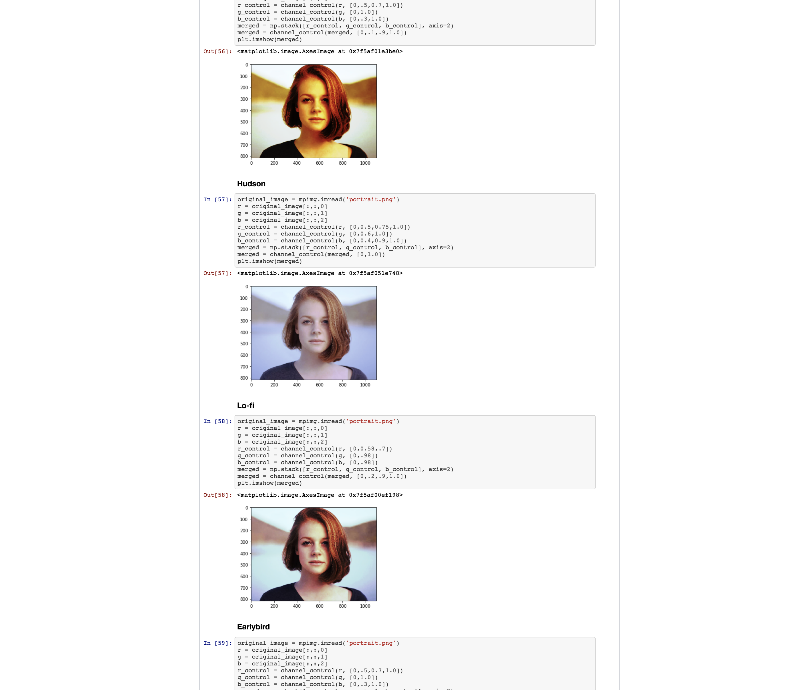

# Numpy - 42 School 2-Day Project

## Description

The purpose of this mini-project was to reproduce different photography filters using Python programming language. Images are build by one or more matrixes (2D or 3D arrays), and changing the values of each character of theses matrixes is how we can affect the entire photo, pixel by pixel. 

NumPy is a Python library for add support for large, multi-dimensional arrays and matrices, along with a large collection of high-level mathematical functions to operate on these arrays.

## Installation
Python 3, Docker and VirtualBox must be installed.

Run the following commands:

`docker-machine start` | Start the "default" virtual machine.

`eval "$(docker-machine env default)"` | Set new IP addresses for started machines.

`docker run -p 8800:8888 -v $(pwd)/notebooks:/notebooks numpy_rush` | Connect to notebook server.

`docker-machine ls` | Check the list of docker machine availables.

From the last two commands respectively, copy the token and the running virtual box IP address and replace the x's in here:

`http://xxx.xxx.xx.xxx:8800/?token=xxxxxxxxxxxxxxxxxxxxxxxxxxxxxxxxxxxxxxxxxxxxxxx`

Example:
`http://192.168.99.100:8800/?token=034f1e8164e65bb1b89f376898831faa03aca054dc15300f`

Then, go to the web browser and paste this link.
Finally, once in Jupyter, upload the file notebook/numpy.ipynb and resources/images/portrait.png

## Usage
`Press 'Run'` | Executes the current code block.

## Preview

